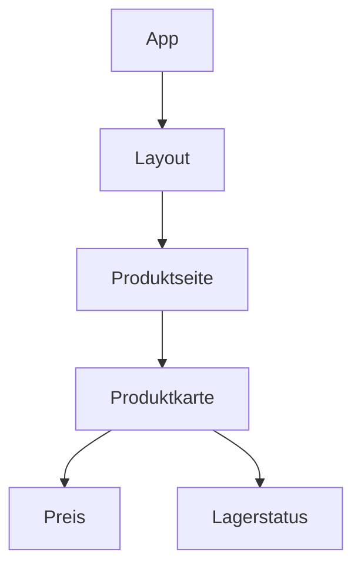
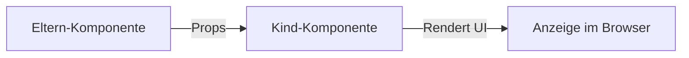

###### Themen

Komponentenhierarchie und Wiederverwendung

- Komponenten verschachteln und zusammensetzen
- Daten von Eltern- zu Kind-Komponenten weitergeben
- Wiederverwendbare Komponenten aufbauen

Listen und dynamisches Rendering

- Arrays mit map() in JSX darstellen
- key-Prop und warum sie bei Listen wichtig ist
- Einfache Listendarstellung aus State oder Props

<br><br><br>
# 🧩 Komponentenhierarchie und Wiederverwendung

In React baust du Benutzeroberflächen nicht als einen einzigen großen Block, sondern als viele kleine Komponenten. Diese Komponenten stehen in einer Hierarchie zueinander: Eine übergeordnete Komponente rendert andere Komponenten, diese wiederum weitere Unterkomponenten. React beschreibt das als einen Baum von Komponenten ([Deine Benutzeroberfläche als Baum](https://react.dev/learn/understanding-your-ui-as-a-tree)).

Das ist einer der wichtigsten Gedanken in React 19 genauso wie in früheren Versionen: Du zerlegst die Oberfläche in sinnvolle Bausteine. Dadurch wird der Code übersichtlicher, leichter wartbar und deutlich besser wiederverwendbar.



Wenn du diese Struktur verstanden hast, wird vieles in React sehr logisch: Eltern-Komponenten geben Daten nach unten weiter, Kinder-Komponenten stellen diese Daten dar, und wiederverwendbare Komponenten bleiben möglichst allgemein, damit du sie an vielen Stellen einsetzen kannst.


<br><br><br>
## 🧱 Komponenten verschachteln und zusammensetzen

„Verschachteln“ bedeutet: Eine Komponente rendert eine andere Komponente in ihrem JSX. „Zusammensetzen“ bedeutet: Du baust aus kleinen Bausteinen eine größere Benutzeroberfläche zusammen.

Ein sehr einfaches Beispiel sieht so aus:

```jsx
function App() {
  return (
    <main>
      <Titel />
      <Produktseite />
    </main>
  );
}

function Titel() {
  return <h1>Mein Shop</h1>;
}

function Produktseite() {
  return <Produktkarte />;
}

function Produktkarte() {
  return <article>Kopfhörer</article>;
}
```

Hier ist `App` die oberste Komponente. `App` rendert `Titel` und `Produktseite`. `Produktseite` rendert wiederum `Produktkarte`. Genau so entsteht eine Komponentenhierarchie.

Wichtig ist: Komponenten werden wie normale HTML-Tags verwendet, aber sie müssen mit einem Großbuchstaben beginnen. Das ist die Konvention in React, damit React erkennen kann, dass es sich um eine eigene Komponente und nicht um ein normales DOM-Element handelt ([Deine erste Komponente](https://react.dev/learn/your-first-component)).

Oft wird Komposition noch mächtiger, wenn du nicht alles fest in eine Komponente einbaust, sondern Platz für beliebigen Inhalt lässt. Dafür wird sehr häufig die Prop `children` verwendet. `children` enthält den Inhalt, der zwischen den öffnenden und schließenden Tag einer Komponente steht ([Passing Props to a Component](https://react.dev/learn/passing-props-to-a-component)).

```jsx
function App() {
  return (
    <Karte>
      <h2>Kopfhörer</h2>
      <p>99 €</p>
    </Karte>
  );
}

function Karte({ children }) {
  return <section className="karte">{children}</section>;
}
```

Hier ist `Karte` eine allgemeine Hülle. Sie weiß nicht im Voraus, ob darin eine Überschrift, ein Bild, ein Formular oder ein Button steckt. Genau das macht sie so flexibel. Diese Art der Zusammensetzung ist in React besonders wertvoll, weil du auf diese Weise Layout-Komponenten, Container und UI-Bausteine sehr sauber wiederverwenden kannst.

Du kannst dir das so merken:

- Verschachteln heißt: Komponenten in Komponenten benutzen.
- Zusammensetzen heißt: Aus kleinen Teilen größere UI-Bereiche bauen.
- `children` ist nützlich, wenn eine Komponente einen „Platzhalter“ für beliebigen Inhalt haben soll.


<br><br><br>
### 🌳 Warum diese Struktur so wichtig ist

Eine gute Komponentenhierarchie hilft dir, Verantwortung klar zu trennen. Eine Komponente soll möglichst nur eine verständliche Aufgabe haben.

Ein typisches Beispiel:

- `Produktseite` kümmert sich um die gesamte Seite.
- `Produktkarte` zeigt ein einzelnes Produkt.
- `Preis` zeigt nur den Preis.
- `Lagerstatus` zeigt nur, ob etwas verfügbar ist.

Dadurch musst du nicht bei jeder Änderung den ganzen Code anfassen. Wenn sich nur die Preisdarstellung ändert, passt du nur die `Preis`-Komponente an. Das macht deinen Code stabiler und verständlicher.

Ein häufiger Fehler am Anfang ist, zu große Komponenten zu schreiben. Dann steckt in einer einzigen Datei alles gleichzeitig: Daten, Layout, Bedingungen, Listen und Event-Logik. Solche Komponenten werden schnell unübersichtlich. In React ist es fast immer besser, größere Oberflächen in kleinere, gut benannte Teile aufzuteilen.


<br><br><br>
### 🧺 Zusammensetzen mit spezialisierten und allgemeinen Komponenten

In einer echten Anwendung mischst du meist zwei Arten von Komponenten:

| Typ | Aufgabe | Beispiel |
|---|---|---|
| Spezialisierte Komponente | Erledigt einen ganz konkreten Zweck | `Produktkarte`, `Benutzerprofil`, `WarenkorbPosition` |
| Allgemeine Komponente | Kann an vielen Stellen benutzt werden | `Karte`, `Button`, `Modal`, `Layout` |

Eine spezialisierte Komponente kennt oft eine bestimmte Struktur. Eine allgemeine Komponente ist bewusst offen gestaltet und bekommt ihr Verhalten oder ihren Inhalt über Props.

```jsx
function Produktkarte({ name, preis }) {
  return (
    <Karte>
      <h2>{name}</h2>
      <Preis wert={preis} />
    </Karte>
  );
}

function Karte({ children }) {
  return <div className="karte">{children}</div>;
}

function Preis({ wert }) {
  return <strong>{wert} €</strong>;
}
```

Hier siehst du sehr schön das Zusammenspiel: `Karte` ist allgemein, `Produktkarte` ist fachlich konkret, `Preis` ist ein kleiner spezialisierter Baustein. So entsteht ein System aus Komponenten, das zugleich strukturiert und flexibel ist.


<br><br><br>
## 📦 Daten von Eltern- zu Kind-Komponenten weitergeben

Daten werden in React typischerweise von oben nach unten weitergegeben. Man spricht von einem einseitigen Datenfluss: Eine Eltern-Komponente übergibt Daten an ihre Kind-Komponenten über Props ([Passing Props to a Component](https://react.dev/learn/passing-props-to-a-component)).

Props kannst du dir wie Parameter einer Funktion vorstellen. Du übergibst sie im JSX, und die Kind-Komponente empfängt sie als Objekt in ihrer Funktionssignatur.

```jsx
function Produktseite() {
  const produkt = {
    name: "Kopfhörer",
    preis: 99,
    verfuegbar: true
  };

  return (
    <Produktkarte
      name={produkt.name}
      preis={produkt.preis}
      verfuegbar={produkt.verfuegbar}
    />
  );
}

function Produktkarte({ name, preis, verfuegbar }) {
  return (
    <article>
      <h2>{name}</h2>
      <p>{preis} €</p>
      <p>{verfuegbar ? "Auf Lager" : "Nicht verfügbar"}</p>
    </article>
  );
}
```

Hier ist `Produktseite` die Eltern-Komponente. Sie besitzt die Daten und reicht sie weiter. `Produktkarte` bekommt diese Daten und stellt sie dar.

Du kannst in React fast alles als Prop weitergeben:

- einzelne Werte wie Strings, Zahlen oder Booleans
- Objekte
- Arrays
- Funktionen
- JSX
- sogar andere Komponenten

Ein Beispiel mit einem Objekt:

```jsx
function Produktseite() {
  const produkt = {
    id: 1,
    name: "Kopfhörer",
    preis: 99
  };

  return <Produktkarte produkt={produkt} />;
}

function Produktkarte({ produkt }) {
  return (
    <article>
      <h2>{produkt.name}</h2>
      <p>{produkt.preis} €</p>
    </article>
  );
}
```

Beides ist möglich: Du kannst entweder viele einzelne Props übergeben oder ein ganzes Objekt. Welche Variante besser ist, hängt vom Fall ab. Einzelne Props sind oft klarer lesbar. Ein Objekt ist praktisch, wenn mehrere zusammengehörige Daten übergeben werden.

Sehr wichtig ist dabei: Eine Kind-Komponente soll Props nicht verändern. Props sind in React als Eingaben zu verstehen, nicht als veränderbare lokale Daten. Komponenten sollen ihre Props wie unveränderliche Werte behandeln ([Keeping Components Pure](https://react.dev/learn/keeping-components-pure)).

Das bedeutet: So etwas ist falsch gedacht:

```jsx
function Produktkarte({ produkt }) {
  produkt.preis = produkt.preis + 10; // nicht gut
  return <p>{produkt.preis} €</p>;
}
```

Stattdessen soll die Kind-Komponente nur lesen und darstellen. Wenn sich Daten ändern sollen, passiert das normalerweise in der Eltern-Komponente oder über State-Updates.



Du kannst dir merken: Eltern geben vor, Kinder zeigen an.


<br><br><br>
### 🔄 Einseitiger Datenfluss in der Praxis

Der einseitige Datenfluss ist in React extrem wichtig, weil er die App berechenbarer macht. Wenn du wissen willst, warum ein Kind etwas Bestimmtes anzeigt, schaust du zuerst auf seine Props. Und wenn du wissen willst, woher diese Props kommen, gehst du in der Hierarchie nach oben.

Ein Beispiel:

```jsx
function App() {
  const benutzername = "Mila";
  return <Profil name={benutzername} />;
}

function Profil({ name }) {
  return <h2>Hallo, {name}</h2>;
}
```

`Profil` zeigt den Namen nicht „magisch“ an. Es bekommt ihn von `App`. Das ist einfach, klar und gut nachvollziehbar.

Auch Funktionen werden oft von oben nach unten als Props weitergegeben. Fachlich ist das ebenfalls „Datenweitergabe von Eltern zu Kind“, nur dass diese Daten hier eine Funktion sind.

```jsx
function Produktseite() {
  function handleKaufen() {
    console.log("Produkt wurde gekauft");
  }

  return <KaufenButton onKaufen={handleKaufen} />;
}

function KaufenButton({ onKaufen }) {
  return <button onClick={onKaufen}>Kaufen</button>;
}
```

Die Funktion kommt von oben. Das Kind führt sie später aus. So kann die Eltern-Komponente steuern, was passieren soll, obwohl der Button unten in der Hierarchie sitzt.


<br><br><br>
## ♻️ Wiederverwendbare Komponenten aufbauen

Wiederverwendbare Komponenten sind Komponenten, die nicht nur an genau einer Stelle funktionieren, sondern in mehreren Situationen. Das erreichst du, indem du sie allgemein genug gestaltest.

Eine schlecht wiederverwendbare Komponente ist oft zu fest verdrahtet:

```jsx
function Warnung() {
  return (
    <div className="warnung rot">
      Fehler: Produkt nicht gefunden
    </div>
  );
}
```

Diese Komponente kann nur genau einen Text und genau einen Stil anzeigen. Wenn du später eine Info- oder Erfolgsnachricht brauchst, musst du neue Komponenten schreiben.

Eine besser wiederverwendbare Version sieht so aus:

```jsx
function Meldung({ typ, kinder }) {
  return <div className={`meldung ${typ}`}>{kinder}</div>;
}
```

Noch idiomatischer in React wäre es, `children` zu verwenden:

```jsx
function Meldung({ typ, children }) {
  return <div className={`meldung ${typ}`}>{children}</div>;
}

function App() {
  return (
    <>
      <Meldung typ="fehler">Produkt nicht gefunden</Meldung>
      <Meldung typ="info">Neue Lieferung morgen</Meldung>
      <Meldung typ="erfolg">Bestellung gespeichert</Meldung>
    </>
  );
}
```

Jetzt ist die Komponente viel flexibler. Der Inhalt kommt von außen, der Typ ebenfalls. Genau das macht Wiederverwendung möglich.

Eine gute wiederverwendbare Komponente hat meist diese Eigenschaften:

| Merkmal | Bedeutung |
|---|---|
| Klarer Zweck | Die Komponente löst ein verständliches Problem |
| Konfigurierbar | Verhalten und Inhalt kommen über Props |
| Nicht zu speziell | Sie ist nicht unnötig an einen Einzelfall gebunden |
| Saubere Schnittstelle | Die Props sind verständlich benannt |
| Gut zusammensetzbar | Sie funktioniert mit `children` oder anderen Bausteinen |

Ein sehr typisches Beispiel ist ein Button:

```jsx
function Button({ variante = "standard", children, onClick }) {
  return (
    <button className={`btn btn-${variante}`} onClick={onClick}>
      {children}
    </button>
  );
}
```

Verwendung:

```jsx
<Button variante="primaer">Speichern</Button>
<Button variante="sekundaer">Abbrechen</Button>
<Button variante="gefahr">Löschen</Button>
```

Hier wird deutlich, wie Wiederverwendung entsteht: dieselbe Komponente, unterschiedliche Inhalte und Varianten.

Wiederverwendung heißt aber nicht, dass jede Komponente maximal allgemein sein muss. Das wäre auch unpraktisch. Eine Komponente sollte so allgemein sein, wie es sinnvoll ist, aber nicht abstrakter. Wenn du zu früh versuchst, eine „Super-Komponente für alles“ zu bauen, wird sie oft kompliziert und schwer verständlich. Besser ist es, erst gute konkrete Komponenten zu bauen und gemeinsame Muster später sauber herauszuziehen.

In React 19 bleibt dieser Grundsatz unverändert wichtig: Gute Komponenten sind klein, klar, über Props steuerbar und sinnvoll zusammensetzbar.


<br><br><br>
### 🛠️ Praktische Regeln für gute Wiederverwendung

Wenn du eine Komponente wiederverwendbar machen willst, helfen dir diese Denkfragen:

- Was ist in dieser Komponente wirklich fest?
- Was könnte von außen kommen?
- Ist der Text hart codiert, obwohl er variieren könnte?
- Ist das Layout allgemein genug?
- Brauche ich `children`, damit anderer Inhalt hineingesetzt werden kann?
- Sind die Props so benannt, dass andere Entwickler sofort verstehen, wofür sie da sind?

Ein kleines Beispiel mit zu starrer und besserer Variante:

```jsx
function BenutzerKarte() {
  return (
    <div className="karte">
      <h2>Max</h2>
      <p>Administrator</p>
    </div>
  );
}
```

Besser:

```jsx
function BenutzerKarte({ name, rolle }) {
  return (
    <div className="karte">
      <h2>{name}</h2>
      <p>{rolle}</p>
    </div>
  );
}
```

Jetzt kann dieselbe Komponente für viele Benutzer verwendet werden:

```jsx
<BenutzerKarte name="Max" rolle="Administrator" />
<BenutzerKarte name="Mila" rolle="Redakteurin" />
<BenutzerKarte name="Tariq" rolle="Support" />
```

Genau daran erkennst du gute Wiederverwendung: Die Struktur bleibt gleich, nur die Daten ändern sich.


<br><br><br>
# 📋 Listen und dynamisches Rendering

In echten Anwendungen zeigst du selten immer denselben festen Inhalt an. Meist hast du Daten: Produkte, Benutzer, Kommentare, Aufgaben, Nachrichten. Diese Daten liegen oft als Array vor. React kann solche Arrays sehr gut in Oberflächenelemente umwandeln.

Das nennt man dynamisches Rendering: Die UI entsteht aus Daten. Wenn sich die Daten ändern, rendert React neu und die Anzeige passt sich an.


<br><br><br>
## 🔁 Arrays mit map() in JSX darstellen

Die JavaScript-Methode `map()` erzeugt aus einem Array ein neues Array. In React ist das besonders praktisch, weil JSX Arrays von Elementen rendern kann ([Rendering Lists](https://react.dev/learn/rendering-lists)).

Ein einfaches Beispiel:

```jsx
function Produktliste() {
  const produkte = [
    { id: 1, name: "Kopfhörer", preis: 99 },
    { id: 2, name: "Tastatur", preis: 79 },
    { id: 3, name: "Maus", preis: 49 }
  ];

  return (
    <ul>
      {produkte.map(produkt => (
        <li key={produkt.id}>
          {produkt.name} – {produkt.preis} €
        </li>
      ))}
    </ul>
  );
}
```

So funktioniert das Schritt für Schritt:

1. `produkte` ist ein Array.
2. `map()` läuft über jedes Element.
3. Für jedes Produkt gibst du JSX zurück.
4. React rendert daraus mehrere `<li>`-Elemente.

Wichtig ist, dass du die `map()`-Anweisung in geschweiften Klammern `{ ... }` in JSX schreibst. Geschweifte Klammern bedeuten in JSX: „Hier kommt JavaScript.“

```jsx
<ul>
  {produkte.map(produkt => (
    <li key={produkt.id}>{produkt.name}</li>
  ))}
</ul>
```

Das ist viel eleganter, als jeden Listeneintrag einzeln von Hand zu schreiben. Außerdem passt sich die Oberfläche automatisch an, wenn das Array mehr oder weniger Elemente enthält.

Du kannst innerhalb von `map()` natürlich auch ganze Komponenten rendern, nicht nur HTML-Tags:

```jsx
function Produktliste({ produkte }) {
  return (
    <section>
      {produkte.map(produkt => (
        <Produktkarte
          key={produkt.id}
          name={produkt.name}
          preis={produkt.preis}
        />
      ))}
    </section>
  );
}
```

Das ist in React sehr typisch: Daten werden mit `map()` in Komponenten übersetzt.

Wenn du nur bestimmte Elemente anzeigen willst, kombinierst du oft `filter()` und `map()`:

```jsx
function Produktliste({ produkte }) {
  return (
    <ul>
      {produkte
        .filter(produkt => produkt.preis < 100)
        .map(produkt => (
          <li key={produkt.id}>
            {produkt.name} – {produkt.preis} €
          </li>
        ))}
    </ul>
  );
}
```

Zuerst filtern, dann rendern. So bleibt dein JSX direkt an den Daten orientiert.


<br><br><br>
### 🧠 Was `map()` in React gedanklich bedeutet

`map()` ist in React mehr als nur eine Schleife. Es ist eine Übersetzung von Daten in Benutzeroberfläche.

Du kannst dir das so vorstellen:

| Daten | Umwandlung | Ergebnis |
|---|---|---|
| Array mit Objekten | `map()` | Array mit JSX-Elementen |

Ein Beispiel:

```jsx
const benutzer = [
  { id: 1, name: "Mila" },
  { id: 2, name: "Noah" }
];
```

wird zu:

```jsx
[
  <li key={1}>Mila</li>,
  <li key={2}>Noah</li>
]
```

React rendert diese Elementliste dann in die Oberfläche. Genau deshalb ist `map()` so zentral für Listen in React: Es verbindet deine Datenstruktur direkt mit der sichtbaren UI.


<br><br><br>
## 🏷️ key-Prop und warum sie bei Listen wichtig ist

Die `key`-Prop ist bei Listen extrem wichtig. React verwendet `key`, um Elemente einer Liste zwischen zwei Render-Durchläufen wiederzuerkennen. So kann React nachvollziehen, welches Element gleich geblieben, hinzugekommen, entfernt oder verschoben worden ist ([Rendering Lists](https://react.dev/learn/rendering-lists)).

Wenn du eine Liste renderst, reicht es also nicht, nur mehrere Elemente zu erzeugen. Jedes direkte Listenelement braucht auch einen stabilen Schlüssel.

```jsx
<ul>
  {produkte.map(produkt => (
    <li key={produkt.id}>{produkt.name}</li>
  ))}
</ul>
```

Warum ist das nötig? Stell dir vor, du hast diese Liste:

- Kopfhörer
- Tastatur
- Maus

Jetzt wird „Tastatur“ gelöscht. Ohne passende `key`-Werte müsste React viel schlechter raten, welches Element welches ist. Mit `key={produkt.id}` weiß React: „Dieses Listenelement gehört genau zu diesem Datensatz.“

Das ist besonders wichtig, wenn:

- Elemente eingefügt werden
- Elemente gelöscht werden
- Elemente sortiert werden
- Elemente ihre Position ändern

Die beste Wahl für `key` ist normalerweise eine stabile ID aus deinen Daten, zum Beispiel eine Datenbank-ID oder eine andere eindeutige Kennung ([Rendering Lists](https://react.dev/learn/rendering-lists)).

Gut:

```jsx
<li key={produkt.id}>{produkt.name}</li>
```

Oft problematisch:

```jsx
<li key={index}>{produkt.name}</li>
```

Der Index ist nur dann halbwegs unkritisch, wenn die Liste wirklich statisch ist, sich also nicht umsortiert, nicht gefiltert wird und keine Einträge dazukommen oder verschwinden. Sobald sich die Reihenfolge ändern kann, sind Indizes als `key` häufig eine schlechte Wahl, weil React dann Elemente falsch zuordnen kann ([Rendering Lists](https://react.dev/learn/rendering-lists)).

Ein weiterer wichtiger Punkt: `key` ist eine spezielle React-Prop. Sie dient React intern zur Identifikation und wird nicht wie normale Props an deine Komponente weitergereicht ([Special Props Warning](https://react.dev/warnings/special-props)).

Das bedeutet:

```jsx
function Produktkarte(props) {
  console.log(props.key); // undefined
  return <div>{props.name}</div>;
}
```

Wenn du die ID in der Komponente selbst brauchst, musst du sie zusätzlich als normale Prop übergeben:

```jsx
<Produktkarte key={produkt.id} id={produkt.id} name={produkt.name} />
```

Dann kann die Komponente `id` normal verwenden, während React `key` intern nutzt.


<br><br><br>
### ⚖️ Gute und schlechte Schlüssel im Vergleich

| Variante | Gut oder schlecht? | Warum |
|---|---|---|
| `key={produkt.id}` | Gut | Stabil und eindeutig |
| `key={benutzer.email}` | Oft gut | Wenn die E-Mail wirklich eindeutig und stabil ist |
| `key={index}` | Oft schlecht | Problematisch bei Einfügen, Löschen oder Umordnen |
| `key={Math.random()}` | Sehr schlecht | Ändert sich bei jedem Rendern, React erkennt nichts wieder |

`Math.random()` ist besonders ungünstig, weil dann bei jedem Rendern neue Schlüssel entstehen. Für React sieht dann jedes Element so aus, als wäre es komplett neu. Das kann unnötige Neuaufbauten verursachen und lokale Zustände von Listenelementen zerstören.

Noch ein wichtiger Detailpunkt: `key` muss nur unter Geschwistern eindeutig sein, also innerhalb derselben Liste. Du brauchst keine global eindeutigen Schlüssel für die gesamte Anwendung, sondern nur innerhalb des direkten gemeinsamen Elternteils ([Rendering Lists](https://react.dev/learn/rendering-lists)).


<br><br><br>
## 📄 Einfache Listendarstellung aus State oder Props

Listen können in React aus `props` oder aus `state` kommen.

`props` bedeuten: Die Daten kommen von außen, also von einer Eltern-Komponente.  
`state` bedeutet: Die Komponente verwaltet die Daten selbst und kann sie im Laufe der Zeit ändern.

Beide Varianten sind im Alltag sehr häufig.


<br><br><br>
### 📥 Listendarstellung aus Props

Wenn eine Eltern-Komponente die Daten liefert, rendert die Kind-Komponente die Liste einfach aus ihren Props.

```jsx
function App() {
  const produkte = [
    { id: 1, name: "Kopfhörer", preis: 99 },
    { id: 2, name: "Tastatur", preis: 79 }
  ];

  return <Produktliste produkte={produkte} />;
}

function Produktliste({ produkte }) {
  return (
    <ul>
      {produkte.map(produkt => (
        <li key={produkt.id}>
          {produkt.name} – {produkt.preis} €
        </li>
      ))}
    </ul>
  );
}
```

Hier besitzt `App` die Daten, `Produktliste` zeigt sie nur an. Das ist eine sehr saubere Aufgabenteilung: Oben liegen die Daten, unten die Darstellung.

Diese Variante ist besonders gut, wenn eine Komponente allgemein wiederverwendbar sein soll. `Produktliste` ist hier rein darstellend. Sie braucht nur ein Array und kann es rendern. Dadurch kannst du dieselbe Komponente an verschiedenen Stellen mit unterschiedlichen Daten nutzen.


<br><br><br>
### 🗂️ Listendarstellung aus State

Wenn sich die Liste im Laufe der Zeit ändern soll, liegt sie oft im State. In React speichert `useState` Werte zwischen Render-Durchläufen, und ein State-Update führt dazu, dass die Komponente erneut gerendert wird ([useState](https://react.dev/reference/react/useState)).

```jsx
import { useState } from "react";

function AufgabenListe() {
  const [aufgaben, setAufgaben] = useState([
    { id: 1, text: "React lernen", erledigt: false },
    { id: 2, text: "Komponenten üben", erledigt: true }
  ]);

  function nurOffeneAnzeigen() {
    setAufgaben(aufgaben.filter(aufgabe => !aufgabe.erledigt));
  }

  return (
    <div>
      <button onClick={nurOffeneAnzeigen}>Nur offene Aufgaben</button>

      <ul>
        {aufgaben.map(aufgabe => (
          <li key={aufgabe.id}>
            {aufgabe.text} {aufgabe.erledigt ? "✅" : "⏳"}
          </li>
        ))}
      </ul>
    </div>
  );
}
```

Hier kommt die Liste nicht von außen, sondern lebt direkt in der Komponente. Sobald `setAufgaben(...)` aufgerufen wird, aktualisiert React die Anzeige passend zum neuen Array ([useState](https://react.dev/reference/react/useState)).

Ganz wichtig dabei: Wenn du Arrays im State änderst, solltest du nicht das bestehende Array direkt verändern, sondern ein neues Array erzeugen. Methoden wie `filter()`, `map()` oder der Spread-Operator helfen dabei. React empfiehlt bei State-Arrays genau diese Art von Updates ([Updating Arrays in State](https://react.dev/learn/updating-arrays-in-state)).

Gut:

```jsx
setAufgaben(aufgaben.filter(aufgabe => !aufgabe.erledigt));
```

Nicht gut:

```jsx
aufgaben.pop();
setAufgaben(aufgaben);
```

Der Grund ist einfach: React erkennt Änderungen zuverlässiger und klarer, wenn du einen neuen Wert übergibst statt den alten direkt zu verändern.


<br><br><br>
### 🔗 Wann Props, wann State?

Der Unterschied ist fachlich sehr wichtig:

| Frage | Props | State |
|---|---|---|
| Woher kommen die Daten? | Von einer Eltern-Komponente | Aus der Komponente selbst |
| Wer kontrolliert die Daten? | Meist die Eltern-Komponente | Die aktuelle Komponente |
| Können sie sich ändern? | Ja, wenn der Elternteil neue Props liefert | Ja, durch State-Updates |
| Typischer Einsatz | Darstellende Komponenten | Interaktive Komponenten |

Ein typisches Muster in React ist deshalb:

- Eine obere Komponente hält die Daten im State.
- Sie gibt die Daten als Props an Unterkomponenten weiter.
- Unterkomponenten rendern daraus Listen.

So verbindest du beide Konzepte sinnvoll miteinander:

```jsx
import { useState } from "react";

function App() {
  const [produkte] = useState([
    { id: 1, name: "Kopfhörer", preis: 99 },
    { id: 2, name: "Tastatur", preis: 79 },
    { id: 3, name: "Maus", preis: 49 }
  ]);

  return <Produktliste produkte={produkte} />;
}

function Produktliste({ produkte }) {
  return (
    <ul>
      {produkte.map(produkt => (
        <li key={produkt.id}>
          {produkt.name} – {produkt.preis} €
        </li>
      ))}
    </ul>
  );
}
```

Hier liegt die Datenquelle in `App` als State, aber die eigentliche Darstellung der Liste ist ausgelagert. Genau das ist sehr typisch für saubere React-Anwendungen: Datenhaltung oben, Darstellung unten, Wiederverwendung in der Mitte.