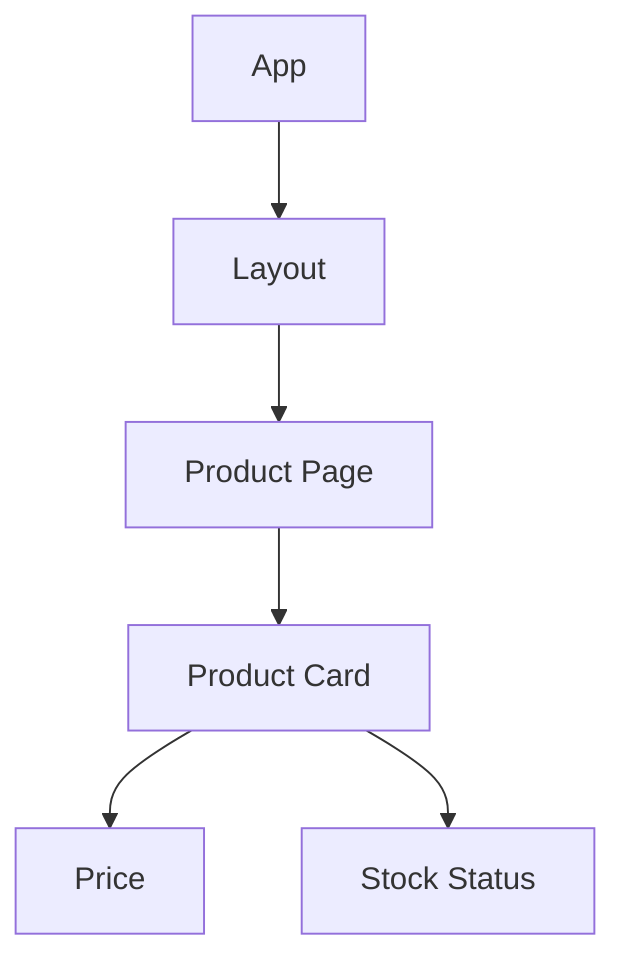
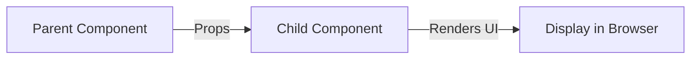

###### Topics

Component hierarchy and reusability

- Nesting and composing components
- Passing data from parent to child components
- Building reusable components

Lists and dynamic rendering

- Rendering arrays with map() in JSX
- key-prop and why it’s important in lists
- Simple list rendering from state or props

<br><br><br>
# 🧩 Component Hierarchy and Reusability

In React, you don’t build user interfaces as a single huge block, but as many small components. These components are organized in a hierarchy: a parent component renders other components, which in turn render further child components. React describes this as a tree of components ([Your UI as a Tree](https://react.dev/learn/understanding-your-ui-as-a-tree)).

This is one of the most important concepts in React 19, as in previous versions: you break down the UI into meaningful building blocks. This makes the code more organized, easier to maintain, and much more reusable.



Once you understand this structure, much of React becomes very logical: parent components pass data down to children, child components display that data, and reusable components are kept as generic as possible so you can use them in many places.


<br><br><br>
## 🧱 Nesting and Composing Components

“Nesting” means: a component renders another component inside its JSX. “Composing” means: you build a larger UI from smaller building blocks.

A very simple example looks like this:

```jsx
function App() {
  return (
    <main>
      <Title />
      <ProductPage />
    </main>
  );
}

function Title() {
  return <h1>My Shop</h1>;
}

function ProductPage() {
  return <ProductCard />;
}

function ProductCard() {
  return <article>Headphones</article>;
}
```

Here, `App` is the topmost component. `App` renders `Title` and `ProductPage`. `ProductPage` renders `ProductCard`. This is exactly how a component hierarchy is created.

Important: components are used like regular HTML tags, but they must start with an uppercase letter. That is the convention in React, so React can detect that it’s a custom component and not a regular DOM element ([Your First Component](https://react.dev/learn/your-first-component)).

Composition becomes even more powerful when you don’t hardcode all content into a component, but instead leave space for arbitrary content. The `children` prop is very often used for this. `children` contains the content between the opening and closing tags of a component ([Passing Props to a Component](https://react.dev/learn/passing-props-to-a-component)).

```jsx
function App() {
  return (
    <Card>
      <h2>Headphones</h2>
      <p>€99</p>
    </Card>
  );
}

function Card({ children }) {
  return <section className="card">{children}</section>;
}
```

Here, `Card` is a generic wrapper. It doesn’t know in advance whether its content is a heading, an image, a form, or a button. That’s exactly what makes it so flexible. This type of composition is particularly valuable in React because it lets you reuse layout components, containers, and UI building blocks in a very clean way.

You can remember it like this:

- Nesting means: using components inside components.
- Composing means: building larger UI areas from smaller parts.
- `children` is useful when a component should act as a “placeholder” for arbitrary content.


<br><br><br>
### 🌳 Why This Structure Is so Important

A good component hierarchy helps you clearly separate responsibilities. A component should do only a single understandable job whenever possible.

A typical example:

- `ProductPage` manages the whole page.
- `ProductCard` displays a single product.
- `Price` only shows the price.
- `StockStatus` only shows whether something is available.

That way, you don’t have to edit the whole codebase for every change. If only the price display changes, you just edit the `Price` component. This makes your code more stable and easier to understand.

A common beginner’s mistake is to write components that are too big. Then, everything is in one single file: data, layout, conditions, lists, and event logic. Those components quickly get messy. In React it’s almost always better to break down larger interfaces into smaller, well-named parts.


<br><br><br>
### 🧺 Composing with Specialized and General Components

In real-world apps, you usually combine two kinds of components:

| Type | Role | Example |
|---|---|---|
| Specialized component | Handles a very specific purpose | `ProductCard`, `UserProfile`, `CartItem` |
| General component | Can be used in many places | `Card`, `Button`, `Modal`, `Layout` |

A specialized component often knows a specific structure. A general component is intentionally open and gets its behavior or content via props.

```jsx
function ProductCard({ name, price }) {
  return (
    <Card>
      <h2>{name}</h2>
      <Price value={price} />
    </Card>
  );
}

function Card({ children }) {
  return <div className="card">{children}</div>;
}

function Price({ value }) {
  return <strong>{value} €</strong>;
}
```

Here you can clearly see the interplay: `Card` is generic, `ProductCard` is business-specific, `Price` is a small specialized building block. This way you get a component system that is both structured and flexible.


<br><br><br>
## 📦 Passing Data from Parent to Child Components

In React, data is typically passed from top to bottom. This is called one-way data flow: a parent component passes data to its child components via props ([Passing Props to a Component](https://react.dev/learn/passing-props-to-a-component)).

You can think of props like function parameters. You pass them in JSX, and the child component receives them as an object in its function signature.

```jsx
function ProductPage() {
  const product = {
    name: "Headphones",
    price: 99,
    available: true
  };

  return (
    <ProductCard
      name={product.name}
      price={product.price}
      available={product.available}
    />
  );
}

function ProductCard({ name, price, available }) {
  return (
    <article>
      <h2>{name}</h2>
      <p>{price} €</p>
      <p>{available ? "In stock" : "Not available"}</p>
    </article>
  );
}
```

Here, `ProductPage` is the parent component. It owns the data and passes it down. `ProductCard` receives this data and displays it.

You can pass virtually anything as props in React:

- single values like strings, numbers, or booleans
- objects
- arrays
- functions
- JSX
- even other components

An example with an object:

```jsx
function ProductPage() {
  const product = {
    id: 1,
    name: "Headphones",
    price: 99
  };

  return <ProductCard product={product} />;
}

function ProductCard({ product }) {
  return (
    <article>
      <h2>{product.name}</h2>
      <p>{product.price} €</p>
    </article>
  );
}
```

Both are possible: you can pass many separate props, or just a whole object. Which is better depends on the use case. Separate props are often more readable. An object is handy when you have multiple related pieces of data.

Very important: a child component should not modify props. In React, props are meant to be inputs, not mutable local data. Components should treat their props as immutable values ([Keeping Components Pure](https://react.dev/learn/keeping-components-pure)).

That means: doing something like this is wrong:

```jsx
function ProductCard({ product }) {
  product.price = product.price + 10; // not good
  return <p>{product.price} €</p>;
}
```

Instead, the child component should only read and display. If data should change, that usually happens in the parent component or via state updates.



Remember: parents dictate, children display.


<br><br><br>
### 🔄 One-way Data Flow in Practice

One-way data flow in React is extremely important because it makes the app more predictable. If you want to know why a child displays something, you first look at its props. If you want to know where those props come from, go up the hierarchy.

An example:

```jsx
function App() {
  const username = "Mila";
  return <Profile name={username} />;
}

function Profile({ name }) {
  return <h2>Hello, {name}</h2>;
}
```

`Profile` doesn’t display the name “magically.” It gets it from `App`. That’s simple, clear, and easy to trace.

Functions are often passed down as props as well. From a business logic perspective, this is also “passing data from parent to child,” but in this case, the data is a function.

```jsx
function ProductPage() {
  function handleBuy() {
    console.log("Product was purchased");
  }

  return <BuyButton onBuy={handleBuy} />;
}

function BuyButton({ onBuy }) {
  return <button onClick={onBuy}>Buy</button>;
}
```

The function comes from above. The child executes it later. This way, the parent component controls what should happen—even if the button is further down in the hierarchy.


<br><br><br>
## ♻️ Building Reusable Components

Reusable components are components that work not just in one place but in various situations. You achieve this by making them generic enough.

A poorly reusable component is often too hardwired:

```jsx
function Warning() {
  return (
    <div className="warning red">
      Error: Product not found
    </div>
  );
}
```

This component can only display exactly one message and exactly one style. If you later need an info or success message, you’d have to write new components.

A much more reusable version looks like this:

```jsx
function Message({ type, children }) {
  return <div className={`message ${type}`}>{children}</div>;
}
```

Or, even more idiomatic in React, using `children`:

```jsx
function Message({ type, children }) {
  return <div className={`message ${type}`}>{children}</div>;
}

function App() {
  return (
    <>
      <Message type="error">Product not found</Message>
      <Message type="info">New shipment tomorrow</Message>
      <Message type="success">Order saved</Message>
    </>
  );
}
```

Now the component is much more flexible. Content and type both come from outside. That is what makes reuse possible.

A good reusable component usually has these features:

| Feature | Meaning |
|---|---|
| Clear purpose | The component solves an understandable problem |
| Configurable | Behavior and content are set via props |
| Not too specific | It’s not unnecessarily tied to a specific single case |
| Clean interface | Props are clearly named and make sense to other devs |
| Composable | Works with `children` or other building blocks |

A typical example is a button:

```jsx
function Button({ variant = "default", children, onClick }) {
  return (
    <button className={`btn btn-${variant}`} onClick={onClick}>
      {children}
    </button>
  );
}
```

Usage:

```jsx
<Button variant="primary">Save</Button>
<Button variant="secondary">Cancel</Button>
<Button variant="danger">Delete</Button>
```

Here you can see how reuse works: the same component, different content and variants.

However, reusability does not mean that every component must be maximally generic. That would be impractical. A component should be as general as it makes sense to be, but not more abstract than needed. If you try to create a "super component for everything" too early, it often becomes complicated and hard to understand. It's better to start by building well-designed specific components and then extract common patterns later.

In React 19, this principle is as important as ever: good components are small, clear, controllable via props, and sensibly composable.


<br><br><br>
### 🛠️ Practical Rules for Good Reusability

If you want to make a component reusable, these questions help:

- What is really fixed in this component?
- What could come from outside?
- Is text hardcoded when it could change?
- Is the layout generic enough?
- Do I need `children` to allow arbitrary content inside?
- Are the props named so other developers instantly understand their purpose?

A small example—too rigid, then better:

```jsx
function UserCard() {
  return (
    <div className="card">
      <h2>Max</h2>
      <p>Administrator</p>
    </div>
  );
}
```

Better:

```jsx
function UserCard({ name, role }) {
  return (
    <div className="card">
      <h2>{name}</h2>
      <p>{role}</p>
    </div>
  );
}
```

Now the same component can be used for many users:

```jsx
<UserCard name="Max" role="Administrator" />
<UserCard name="Mila" role="Editor" />
<UserCard name="Tariq" role="Support" />
```

That’s the sign of good reuse: structure stays the same, only the data changes.


<br><br><br>
# 📋 Lists and Dynamic Rendering

In real applications, you rarely show fixed, unchanging content. Usually you have data: products, users, comments, tasks, messages. This data is often in the form of an array. React is very good at turning such arrays into UI elements.

This is called dynamic rendering: The UI emerges from the data. When the data changes, React re-renders and the display automatically updates.


<br><br><br>
## 🔁 Rendering Arrays with map() in JSX

The JavaScript `map()` method creates a new array from an existing array. In React, this is especially handy because JSX can directly render arrays of elements ([Rendering Lists](https://react.dev/learn/rendering-lists)).

A simple example:

```jsx
function ProductList() {
  const products = [
    { id: 1, name: "Headphones", price: 99 },
    { id: 2, name: "Keyboard", price: 79 },
    { id: 3, name: "Mouse", price: 49 }
  ];

  return (
    <ul>
      {products.map(product => (
        <li key={product.id}>
          {product.name} – {product.price} €
        </li>
      ))}
    </ul>
  );
}
```

Here’s how it works, step by step:

1. `products` is an array.
2. `map()` iterates over each item.
3. For each product, you return JSX.
4. React renders several `<li>` elements from that.

It’s important that you write your `map()` statement in curly braces `{ ... }` in JSX. Curly braces mean: “Here comes JavaScript.”

```jsx
<ul>
  {products.map(product => (
    <li key={product.id}>{product.name}</li>
  ))}
</ul>
```

This is much more elegant than writing each list item by hand. Also, the UI automatically adapts if the array has more or fewer items.

You can also render entire components in `map()`, not just HTML tags:

```jsx
function ProductList({ products }) {
  return (
    <section>
      {products.map(product => (
        <ProductCard
          key={product.id}
          name={product.name}
          price={product.price}
        />
      ))}
    </section>
  );
}
```

This is very typical in React: data is translated into components using `map()`.

If you just want to display certain elements, you often chain `filter()` and `map()`:

```jsx
function ProductList({ products }) {
  return (
    <ul>
      {products
        .filter(product => product.price < 100)
        .map(product => (
          <li key={product.id}>
            {product.name} – {product.price} €
          </li>
        ))}
    </ul>
  );
}
```

Filter first, then render. This keeps your JSX closely aligned with the data.


<br><br><br>
### 🧠 What `map()` Means Conceptually in React

In React, `map()` is more than just a loop. It’s a translation of data into the UI.

You can think of it like this:

| Data | Conversion | Result |
|---|---|---|
| Array of objects | `map()` | Array of JSX elements |

Example:

```jsx
const users = [
  { id: 1, name: "Mila" },
  { id: 2, name: "Noah" }
];
```

becomes:

```jsx
[
  <li key={1}>Mila</li>,
  <li key={2}>Noah</li>
]
```

React renders this array of elements into the interface. That’s exactly why `map()` is so central for lists in React: it connects your data directly to the visible UI.


<br><br><br>
## 🏷️ key-prop and Why It’s Important for Lists

The `key` prop is extremely important for lists. React uses `key` to recognize list elements between two render passes, so it can figure out which element has stayed the same, been added, removed, or reordered ([Rendering Lists](https://react.dev/learn/rendering-lists)).

So when you render a list, it’s not enough to just create several elements. Each direct child in the list also needs a stable key.

```jsx
<ul>
  {products.map(product => (
    <li key={product.id}>{product.name}</li>
  ))}
</ul>
```

Why is this necessary? Imagine you have this list:

- Headphones
- Keyboard
- Mouse

Now “Keyboard” is deleted. Without proper `key` values, React would have a much harder time guessing which list item is which. With `key={product.id}`, React knows: “This list element belongs to this specific data record.”

This is especially critical when:

- Elements are inserted
- Elements are deleted
- Elements are sorted
- Elements change position

Usually the best choice for `key` is a stable ID from your data, e.g. a database ID or some other unique identifier ([Rendering Lists](https://react.dev/learn/rendering-lists)).

Good:

```jsx
<li key={product.id}>{product.name}</li>
```

Often problematic:

```jsx
<li key={index}>{product.name}</li>
```

Index as key is only acceptable if the list is truly static—no resorting, filtering, inserting, or deleting. As soon as elements can be added, removed, or reordered, indices used as `key` are often a bad choice, because React may then match items incorrectly ([Rendering Lists](https://react.dev/learn/rendering-lists)).

Another key point: `key` is a special React prop. React uses it internally for identification and does not pass it down to your component as a regular prop ([Special Props Warning](https://react.dev/warnings/special-props)).

This means:

```jsx
function ProductCard(props) {
  console.log(props.key); // undefined
  return <div>{props.name}</div>;
}
```

If you need the ID inside your component, you must also pass it as a regular prop:

```jsx
<ProductCard key={product.id} id={product.id} name={product.name} />
```

Then your component can use `id` as normal, while React uses `key` for internal purposes.


<br><br><br>
### ⚖️ Good and Bad Keys Compared

| Variant | Good or bad? | Why |
|---|---|---|
| `key={product.id}` | Good | Stable and unique |
| `key={user.email}` | Often good | If the email is truly unique and stable |
| `key={index}` | Often bad | Problematic when inserting, removing, or reordering |
| `key={Math.random()}` | Very bad | Changes every render, React can’t match anything reliably |

`Math.random()` is especially bad, because each render produces new keys. For React, all the elements look completely new. This can cause unnecessary DOM rebuilds and destruction of local state within list elements.

One more important detail: keys need only be unique among siblings, i.e., within the same list. There’s no need for globally unique keys for the entire app—just for children of the same parent ([Rendering Lists](https://react.dev/learn/rendering-lists)).


<br><br><br>
## 📄 Simple List Rendering from State or Props

Lists in React can come from `props` or from `state`.

`props` means: the data comes from outside, i.e., from a parent component.  
`state` means: the component manages the data itself and it can change during its lifecycle.

Both variants are very common.


<br><br><br>
### 📥 Rendering Lists from Props

When a parent component provides the data, the child component simply renders the list from its props.

```jsx
function App() {
  const products = [
    { id: 1, name: "Headphones", price: 99 },
    { id: 2, name: "Keyboard", price: 79 }
  ];

  return <ProductList products={products} />;
}

function ProductList({ products }) {
  return (
    <ul>
      {products.map(product => (
        <li key={product.id}>
          {product.name} – {product.price} €
        </li>
      ))}
    </ul>
  );
}
```

Here, `App` owns the data, `ProductList` just displays it. This is a very clean task division: data at the top, presentation at the bottom.

This variant is especially good when a component should be reusable. `ProductList` here is purely presentational. It just needs an array and can render it. This allows you to use the same component in different places with different data.


<br><br><br>
### 🗂️ Rendering Lists from State

When the list should change over time, it’s usually held in state. In React, `useState` stores values between renders, and a state update triggers a re-render ([useState](https://react.dev/reference/react/useState)).

```jsx
import { useState } from "react";

function TaskList() {
  const [tasks, setTasks] = useState([
    { id: 1, text: "Learn React", done: false },
    { id: 2, text: "Practice components", done: true }
  ]);

  function showOnlyOpenTasks() {
    setTasks(tasks.filter(task => !task.done));
  }

  return (
    <div>
      <button onClick={showOnlyOpenTasks}>Show only open tasks</button>

      <ul>
        {tasks.map(task => (
          <li key={task.id}>
            {task.text} {task.done ? "✅" : "⏳"}
          </li>
        ))}
      </ul>
    </div>
  );
}
```

Here, the list doesn’t come from outside, but lives directly within the component. Once you call `setTasks(...)`, React updates the display to reflect the new array ([useState](https://react.dev/reference/react/useState)).

Very important: When updating arrays in state, don’t modify the existing array directly, but create a new array. Methods like `filter()`, `map()`, or the spread operator help with that. React specifically recommends this type of update for state arrays ([Updating Arrays in State](https://react.dev/learn/updating-arrays-in-state)).

Good:

```jsx
setTasks(tasks.filter(task => !task.done));
```

Not good:

```jsx
tasks.pop();
setTasks(tasks);
```

Reason: React can reliably and clearly track changes if you give it a new value instead of mutating the old one.


<br><br><br>
### 🔗 When to Use Props, When to Use State?

It’s an important distinction:

| Question | Props | State |
|---|---|---|
| Where does the data come from? | From a parent component | From the component itself |
| Who controls the data? | Usually the parent component | The current component |
| Can it change? | Yes, if the parent provides new props | Yes, via state updates |
| Typical use case | Presentational components | Interactive components |

A typical React pattern is therefore:

- An upper component holds the data in state.
- It passes the data as props to child components.
- Child components render lists from that.

That’s how you sensibly combine both concepts:

```jsx
import { useState } from "react";

function App() {
  const [products] = useState([
    { id: 1, name: "Headphones", price: 99 },
    { id: 2, name: "Keyboard", price: 79 },
    { id: 3, name: "Mouse", price: 49 }
  ]);

  return <ProductList products={products} />;
}

function ProductList({ products }) {
  return (
    <ul>
      {products.map(product => (
        <li key={product.id}>
          {product.name} – {product.price} €
        </li>
      ))}
    </ul>
  );
}
```

Here, the data source lives in `App` as state, but the actual list display is outsourced. This is typical for clean React apps: data at the top, rendering at the bottom, reusability in the middle.